# Annotated walkthrough — every flow, screen by screen

Walked 2026-08-09 against the shared dev server at `http://localhost:4000`, at
**390×844** (a real phone), with a spot-check pass at **375×553** (iPhone SE, the short
viewport). Every frame below is a screenshot I actually took; nothing here is described
from source.

---

## Summary — the bad news first

| | |
|---|---|
| **Screens walked** | **85** frames — the ten requested flows (§01–§69), a short-viewport pass (§70–§78) and a dead-end hunt (§79–§83) — plus 38 companion `-b` frames showing the scrolled state of any screen taller than the viewport. 123 PNGs in all. |
| **Passed** | **85** |
| **Failed** | **0** |

**There are no FAILs.** At every one of the 85 screens I could name the obvious next step
without hesitating, including on the paths that usually rot — a bad share link, a
cancelled session, a spent resend budget, a link preview that fails, a signed-out visitor
hitting a private URL. I went looking for dead ends specifically (flows 79–83 exist only
because I went hunting) and did not find one.

That verdict is worth taking seriously precisely because it is unusual, so here is the
standard I held: a screen passes if, after the action that got me there, the next thing to
do is on screen and unambiguous. A screen fails if I have to guess, scroll blindly, or
leave to find out what happened. Five screens came close enough to argue about and are
listed below as confusions, not failures.

### The five things that still confused me

Ranked by how much they cost a first-time user. None of these blocks anyone.

1. **The `Custom…` deadline chip does nothing and never says why** (§24, §71) — kind 1,
   unreadable affordance. It sits in a row of three live chips, is drawn dashed and grey,
   and carries `title="Coming soon"` — a tooltip that cannot fire on a touch screen. A
   phone user who wants a deadline other than the three presets taps it, gets nothing at
   all, and gets no explanation. Compare `02 add options`, which draws its dead `Bars` and
   `Movies` chips the same way but puts *"Restaurants first. More types as we grow."*
   right underneath. The deadline row's caption talks about something else entirely
   (*"Hard deadline. Voting locks itself and picks the winner."*). One sentence fixes it.
2. **The four coloured tiles on the share screen look like four targets and are one**
   (§36) — kind 5, ambiguous duplication. They are `aria-hidden` decoration inside a
   single `Open your phone's share sheet →` button, so every tap does the same correct
   thing. Harmless in outcome, but they are drawn with the full sticker treatment — 2px
   ink border, solid mint/amber/lilac fills — next to a `QR SOON` tile that *is* correctly
   drawn dashed and grey. The one inert thing on that screen is honestly marked and the
   four decorative things are not.
3. **The account menu does not close on Escape** (§11). It closes on an outside tap and on
   a second tap of `⋯`, so on a phone there is no problem at all — but
   `docs/plans/chrome-and-feedback.md` ruling 4 states it "closes on Escape by itself",
   and it does not. Desktop keyboard users have no keyboard dismissal.
4. **Registering with a password sends an email nobody is told about** (§10).
   `UserLive.Registration` calls `Accounts.deliver_login_instructions/2` on every
   successful sign-up, including the password path, but the landing screen says only
   *"Account created successfully!"*. The account is unconfirmed and the screen never says
   so. Nothing on screen is *wrong* — but an unannounced email arrives, and the one state
   the user is in is invisible to them.
5. **The completed-results URL wraps mid-word** (§58). `/groups/57/r` / `eview` split
   across two lines in the thank-you screen's "Included the screen you were on" line.
   Cosmetic.

### Two places the plan document is now behind the code

Not defects — the code is better than the plan in both cases — but anyone reading
`docs/plans/chrome-and-feedback.md` as current will be misled:

- **Ruling 8** says the `/join` tree "gets the footer's credits and nothing else" because
  a footer link on a ballot would silently discard the guest's picks. Commit `eb9e1d5`
  ("Restore the full footer on the /join tree, guarded rather than absent") replaced that
  with something stronger, and I verified all of it in the browser: the ballot carries the
  full footer, every link on it (**including** the outbound `marketfinder.us` one) gains a
  `data-confirm` — *"Leave without sending? Your picks aren't saved yet, and this link is
  the only way back."* — the moment anything is picked, each link's `?return_to=` carries
  the pick state in its query string, a `beforeunload` handler covers reload and close,
  and coming back restores the picks exactly (§40, and the round trip in "What I verified
  by hand" below). The rule as written is now wrong.
- **CLAUDE.md** says `HomeLive` "deliberately still routes a `:voting` group to
  `GroupLive.Review`". It routes to `/groups/:id/results` (verified: draft →
  `/groups/57/options`, voting → `/groups/58/results`, completed →
  `/groups/56/results`). The current behaviour is the right one.

### How I drove it, and what that means for these screenshots

I drove headless Chromium via Playwright rather than the shared browser pane, because the
pane's click actions were timing out in this environment and because I needed real PNG
files on disk. Every interaction below is a real DOM event through the real LiveView
socket — real clicks, real form submits, real websocket round trips.

**Screenshots are viewport-sized, not full-page, and that is deliberate.** My first pass
used full-page captures and they *lied*: every screen in this app has a sticky header, and
most app screens have a sticky bottom action bar, which a full-page capture paints in the
middle of the document. The completed-results screen looked catastrophically broken in a
full-page capture and is perfectly fine in reality. Everything below is what the phone
actually shows. Where the document is taller than the viewport there is a companion
`-b.png` frame showing the bottom of the same screen.

**The tree moved under me.** Other agents were editing this working tree throughout the
walk. The dev server 500'd once mid-walk on a `ballot.ex` parse error (I waited and
retried, per the shared brief). Commit `eb9e1d5` landed partway through, which is why
frames 47–52 show the older credits-only `/join` footer and frames 38–43 show the current
full footer on the same kind of screen. I have flagged that where it appears rather than
re-shooting and pretending the walk was atomic.

---

## Flow 1 — cold visitor, signed out

### 01 — the splash

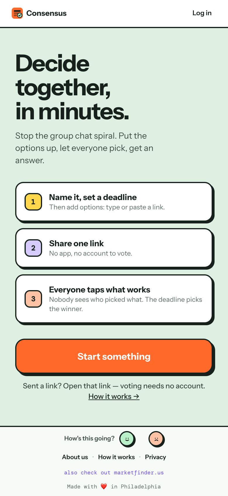

**Route:** `/` · **What I did:** opened the app with no cookies at all.

**The obvious next step here is** the tangerine `Start something` button — the only
tangerine on the screen, sitting under three numbered cards that have just explained what
starting something means.

Nothing confused me. The line under the button — *"Sent a link? Open that link — voting
needs no account."* — pre-empts the one wrong turn a first-timer can take here (a voter
arriving at the marketing page and hunting for a sign-up). The footer's unexplained
`also check out marketfinder.us` is the only thing on the page I could not account for; it
is answered on the privacy page (§04) and it carries `rel="noopener noreferrer"`, so it
leaks nothing.

### 02 — how it works

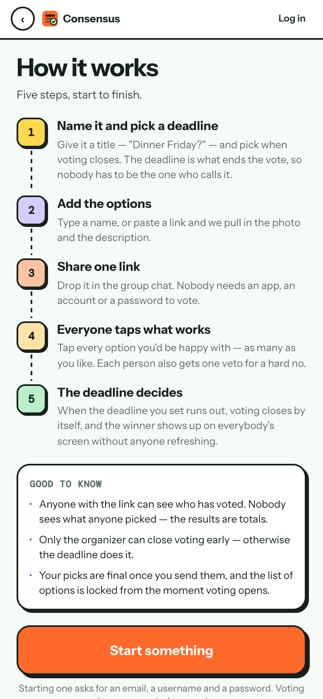
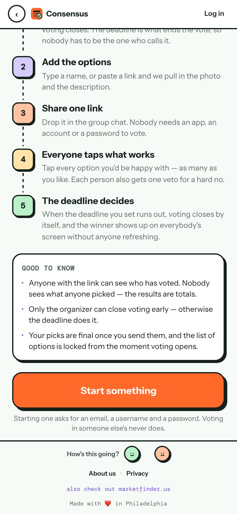

**Route:** `/how-it-works?return_to=%2F` · **What I did:** tapped `How it works` in the
footer.

**The obvious next step here is** `Start something` at the bottom — or the `‹` circle in
the header, which goes back to exactly where I came from (`/`, from the `return_to`).

The `GOOD TO KNOW` card does real work: it states in advance that picks are final and that
the option list locks when voting opens — the two irreversible moments — instead of
surprising anyone with them later. The footer correctly drops its own link while I am on
this page.

### 03 — about

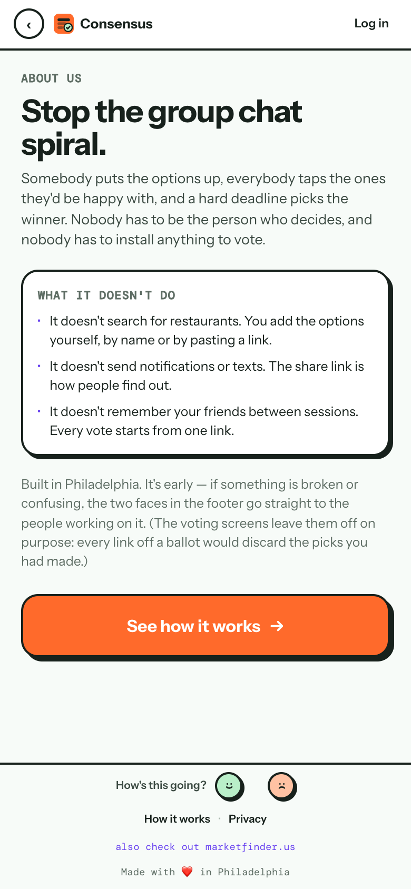

**Route:** `/about?return_to=%2F` · **What I did:** tapped `About us`.

**The obvious next step here is** `See how it works →` at the bottom, with `‹` back to `/`.

Honest page. `WHAT IT DOESN'T DO` says out loud that there is no restaurant search, no
notifications and no saved friend groups — three things a naive user would otherwise hunt
for. It also explains why the voting screens leave the feedback faces off, which was true
when it was written and is no longer (see the ruling-8 note above); that sentence is now
stale copy.

### 04 — privacy

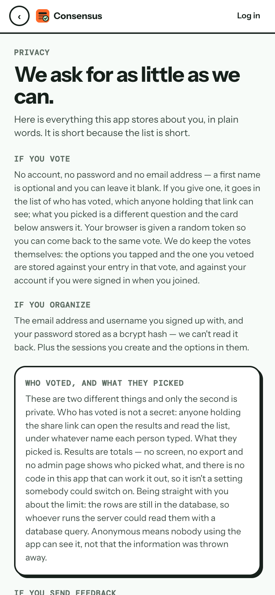
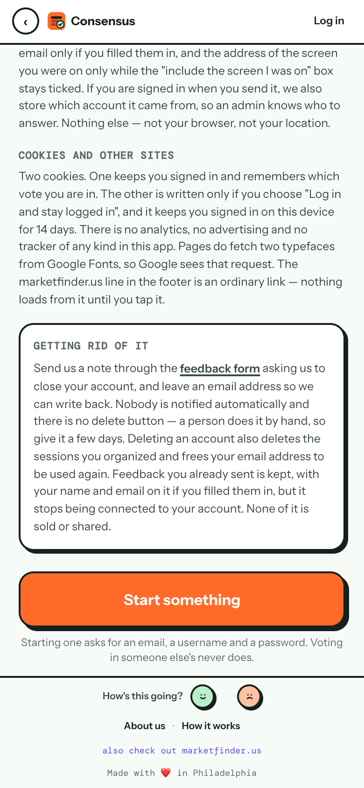

**Route:** `/privacy?return_to=%2F` · **What I did:** tapped `Privacy`.

**The obvious next step here is** `Start something`, with `‹` back.

The best page in the app. It distinguishes *who voted* (public to anyone with the link)
from *what they picked* (private), and then names its own limit — *"the rows are still in
the database, so whoever runs the server could read them"*. It also explains the
`marketfinder.us` footer line and the Google Fonts request. Long, but the page tells you
so in its second sentence.

### 05 — log in

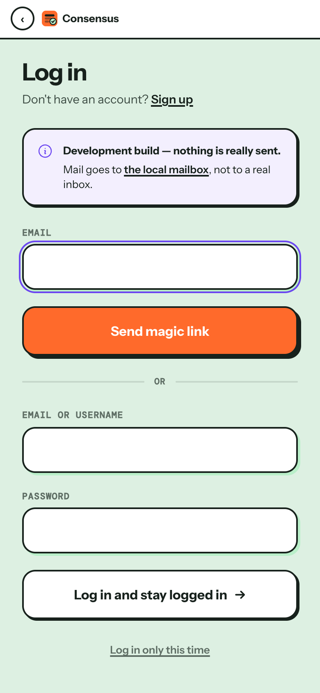
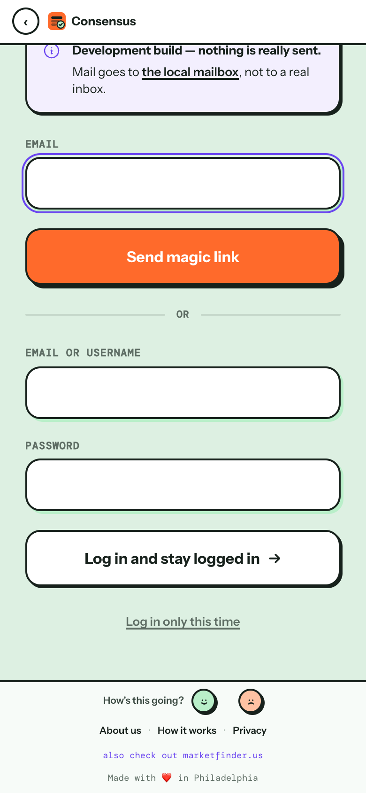

**Route:** `/users/log-in` · **What I did:** tapped `Log in` in the header.

**The obvious next step here is** the tangerine `Send magic link`, or the password form
under the `OR` rule.

The dev-only violet card saying *"Development build — nothing is really sent"* with a link
straight to the local mailbox is exactly right for this environment. Two password buttons
(`Log in and stay logged in →` and `Log in only this time`) are not ambiguous duplication
— they are the remember-me choice, spelled out instead of hidden behind a checkbox.

### 06 / 07 — the two feedback faces

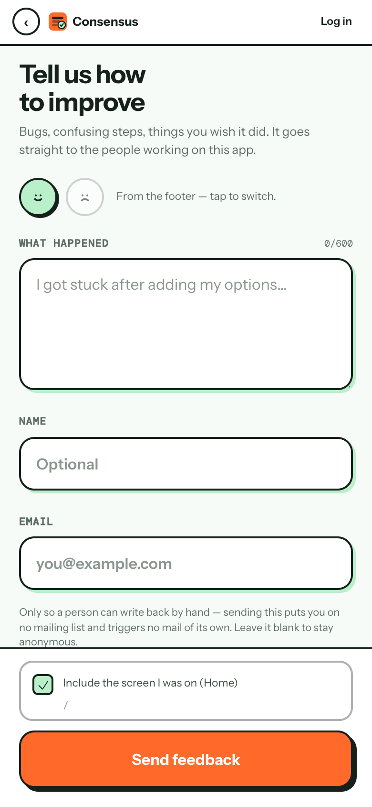
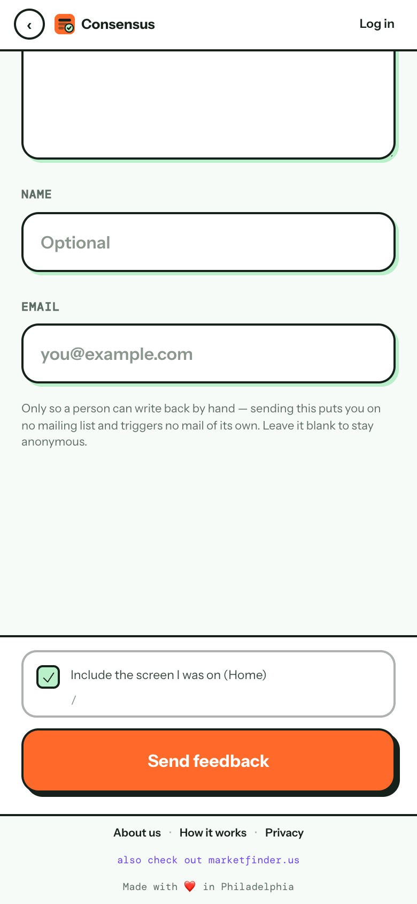
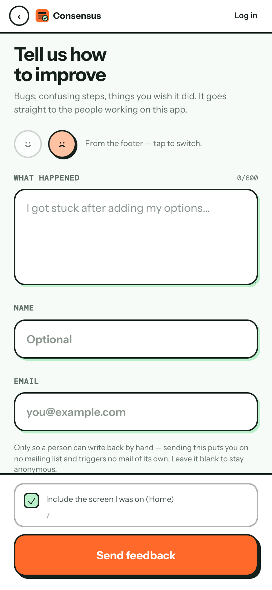

**Routes:** `/feedback?mood=happy&return_to=%2F` and `?mood=sad` · **What I did:** tapped
each face in the footer.

**The obvious next step here is** typing in `WHAT HAPPENED` and pressing the tangerine
`Send feedback`.

Which face I tapped is visible — the chosen one is filled, the other outlined — and
`From the footer — tap to switch.` says the choice is changeable. Name and email are
labelled `Optional` and the paragraph under them says leaving them blank keeps you
anonymous. The `Include the screen I was on (Home)` checkbox shows the literal path it
would send. The counter reads `0/600` with no `maxlength` on the textarea, which is
invariant 11 honoured. The heading is *"Tell us how to improve"* on both faces, which
reads slightly odd over the happy one.

---

## Flow 2 — register with a password

### 08 — the registration form

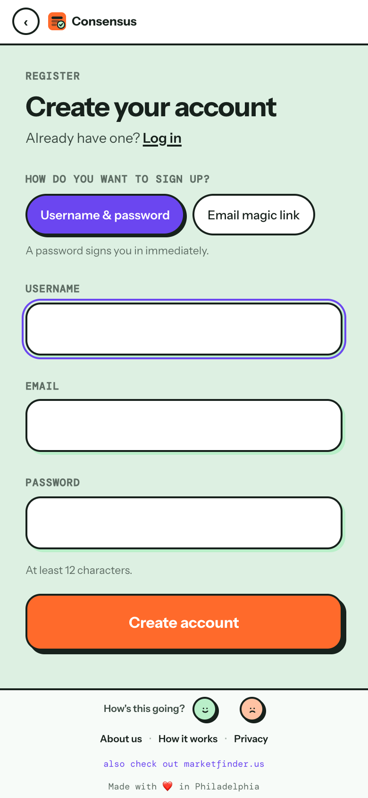

**Route:** `/users/register` · **What I did:** tapped `Sign up` from the log-in screen.

**The obvious next step here is** filling three fields and pressing `Create account`. The
mode is chosen for you (`Username & password` is pre-selected, violet) and the consequence
is stated: *"A password signs you in immediately."*

### 09 — filled in

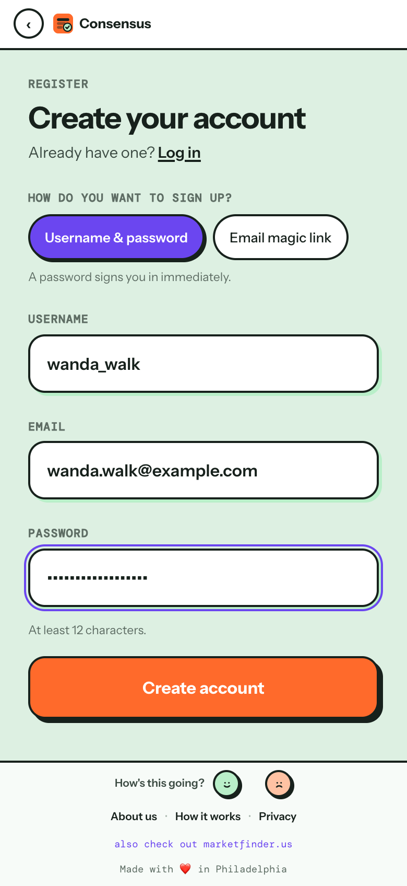

**Route:** `/users/register` · **What I did:** typed a username, an email and a password.

**The obvious next step here is** `Create account`. `At least 12 characters.` is stated
before submitting rather than after being rejected.

### 10 — landed, signed in

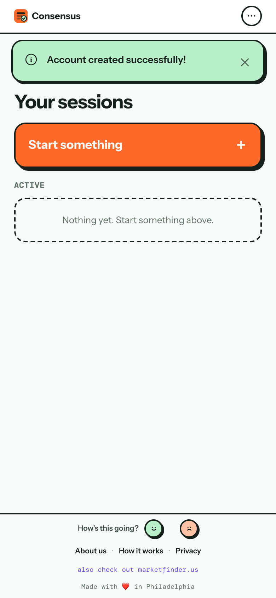

**Route:** `/` · **What I did:** pressed `Create account`.

**The obvious next step here is** `Start something ＋` — the only tangerine on screen,
directly under the empty-state box that says *"Nothing yet. Start something above."*

Confusion, mild (see summary item 4): a confirmation email was sent and nothing says so;
the account is unconfirmed and nothing says that either. Everything visible is correct, so
this is an omission rather than a contradiction.

### 11 — the `⋯` account menu

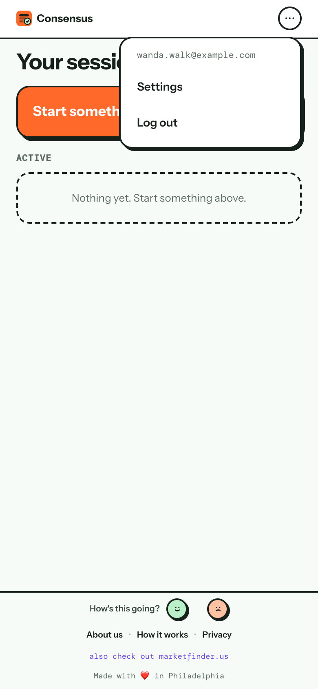

**Route:** `/` · **What I did:** tapped `⋯`.

**The obvious next step here is** picking `Settings` or `Log out`, or tapping outside to
dismiss — which I verified works, as does a second tap on `⋯`.

The account's email sits at the top in muted monospace, so you can tell *which* account
you are in. Escape does not close it (summary item 3), which does not matter on a phone.

---

## Flow 3 — register by magic link

### 12 / 13 — the magic-link mode

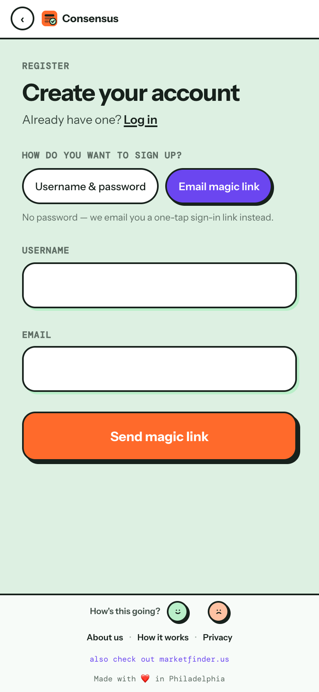
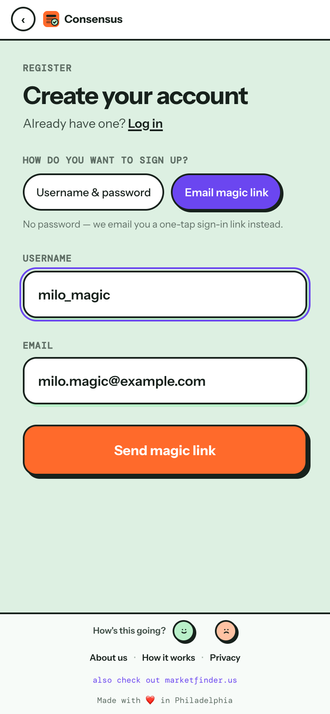

**Route:** `/users/register` · **What I did:** tapped `Email magic link`, then filled in a
username and an email.

**The obvious next step here is** `Send magic link`. The password field is gone and the
caption changed to *"No password — we email you a one-tap sign-in link instead."* — the
mode change is visible in three places at once (the pill, the caption, the missing field).

### 14 — the full-page success screen

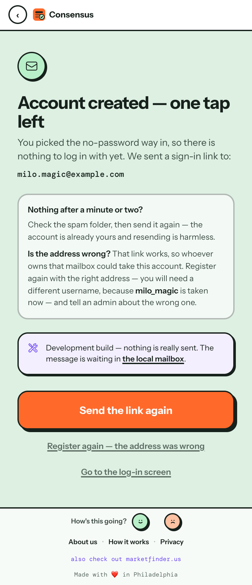

**Route:** `/users/register` (the `{:sent, address}` state) · **What I did:** pressed
`Send magic link`.

**The obvious next step here is** leaving for the inbox — and the screen says so, then
gives three fallbacks: `Send the link again`, `Register again — the address was wrong`,
`Go to the log-in screen`.

This is the screen the whole "no dead ends" plan was written for, and it lands. It states
what happened, echoes the exact address, explains what to do if nothing arrives, and — the
part I did not expect — spells out the security consequence of a typo: *"That link works,
so whoever owns that mailbox could take this account."* It also warns that the username is
now taken. Nothing here is a flash.

### 15 — where the mail lands

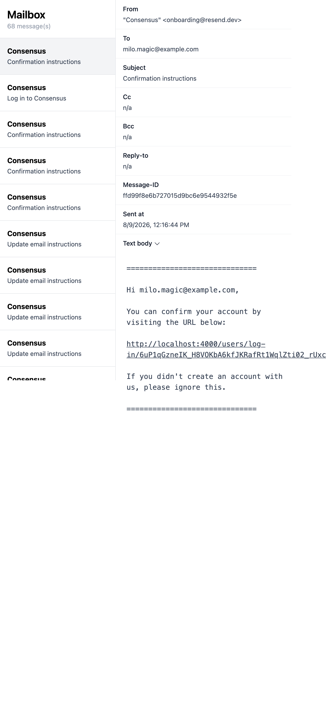

**Route:** `/dev/mailbox/<id>` · **What I did:** followed `the local mailbox` link.

**The obvious next step here is** clicking the `http://localhost:4000/users/log-in/<token>`
link in the message body.

This is Swoosh's own preview UI, not this app's — it is not mobile-responsive and does not
wear the chrome. That is fine; it is a development tool and it exists in no other
environment.

### 16 — the confirmation screen

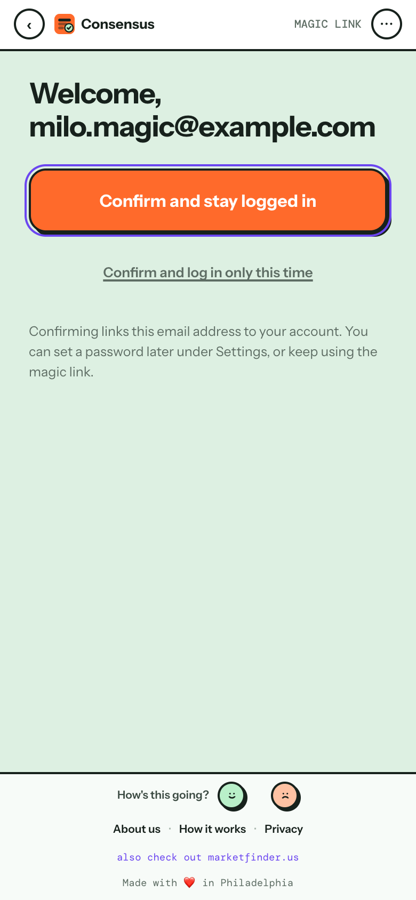

**Route:** `/users/log-in/<token>` · **What I did:** opened the link from the email.

**The obvious next step here is** the tangerine `Confirm and stay logged in`, with
`Confirm and log in only this time` under it as the secondary.

`MAGIC LINK` in the header's context slot tells you which mode you are in. The paragraph
below says what confirming does and that a password can be set later.

### 17 — signed in

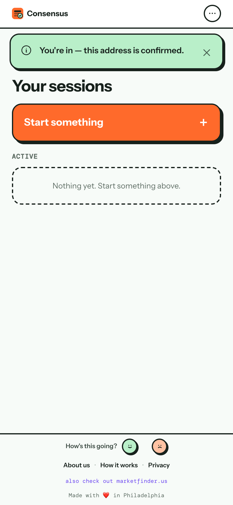

**Route:** `/` · **What I did:** pressed `Confirm and stay logged in`.

**The obvious next step here is** `Start something ＋`. The flash — *"You're in — this
address is confirmed."* — reports the state change rather than just saying "welcome".

---

## Flow 4 — log in by magic link, and spending the resend budget

### 18 — check your email

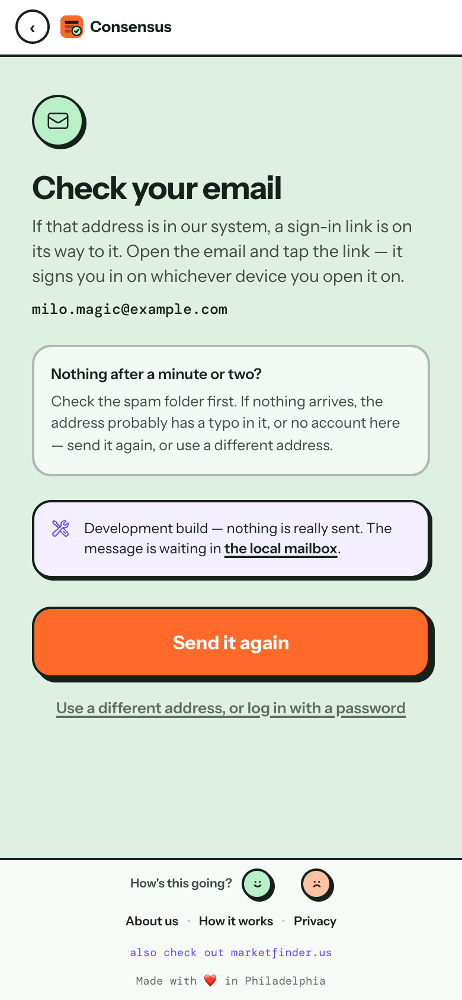

**Route:** `/users/log-in` (`{:sent, address}`) · **What I did:** entered a registered
address and pressed `Send magic link`.

**The obvious next step here is** the inbox; on screen, `Send it again` or
`Use a different address, or log in with a password`.

The wording is carefully non-committal — *"If that address is in our system, a sign-in link
is on its way"* — and I confirmed at §23 that an unregistered address produces the
byte-identical screen. That is enumeration resistance done properly, and it does not cost
the user anything, because the fallback card tells them what to do either way.

### 19 / 20 — resending

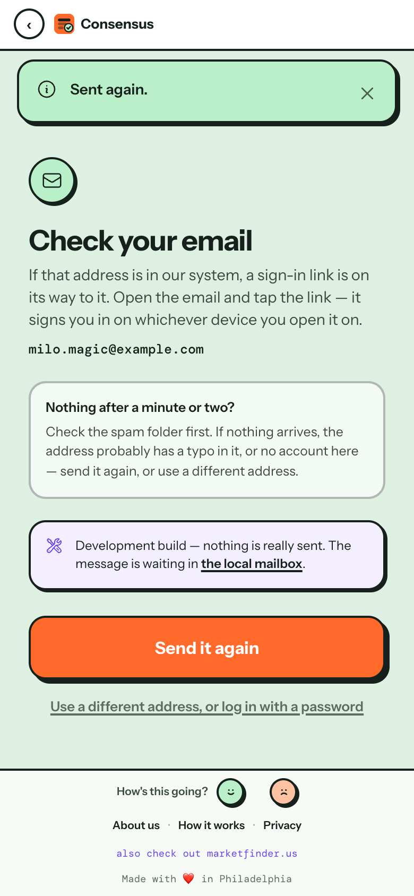

**Route:** `/users/log-in` · **What I did:** pressed `Send it again`, twice.

**The obvious next step here is** still the inbox; `Send it again` is still there.

Each press flashes a green **Sent again.** — the action is acknowledged, which matters for
a control whose entire effect happens somewhere else.

### 21 — the budget is spent

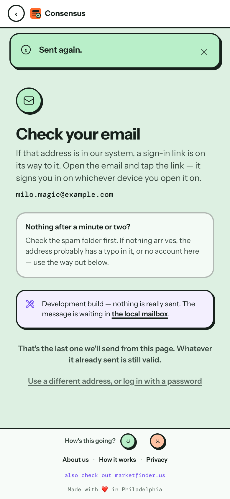

**Route:** `/users/log-in` · **What I did:** pressed `Send it again` a third time. The
per-mount budget is 4 sends; the first submit spent one.

**The obvious next step here is** `Use a different address, or log in with a password` —
the only control left.

The screen handles this well. `Send it again` is **removed**, not disabled, and replaced
by a sentence that says why: *"That's the last one we'll send from this page. Whatever it
already sent is still valid."* The fallback paragraph above it also re-words itself, from
"send it again, or use a different address" to "use the way out below" — so the screen
never instructs a press it has just taken away. The green **Sent again.** flash above is
still accurate: that third press did send.

### 22 — starting over

**Route:** `/users/log-in` · **What I did:** tapped `Use a different address, or log in
with a password`.

**The obvious next step here is** typing an address into `EMAIL` and pressing
`Send magic link`, or using the password form below.

With the budget spent this control is a real HTTP navigation rather than a LiveView event,
so the page remounts with a fresh budget — which is the *"reload this page"* the exhausted
copy prescribes, reached in one tap. Worth knowing (not a UX issue): that makes the cap
per page-load, not per address, so it slows an inbox-flooding script rather than stopping
one.

### 23 — a different address

**Route:** `/users/log-in` · **What I did:** submitted `nobody.here@example.com`, an
address with no account.

**The obvious next step here is** the inbox, or `Send it again`.

The screen is identical to §18 in every respect — same heading, same lede, same fallback,
same controls — with only the echoed address different. An attacker learns nothing; a
user with a typo is told, in the fallback card, that a typo or a missing account is the
likely explanation.

---

## Flow 5 — an organizer builds a pool

Session: *"Dinner Friday?"*, group 58.

### 24 — step 1 of 3

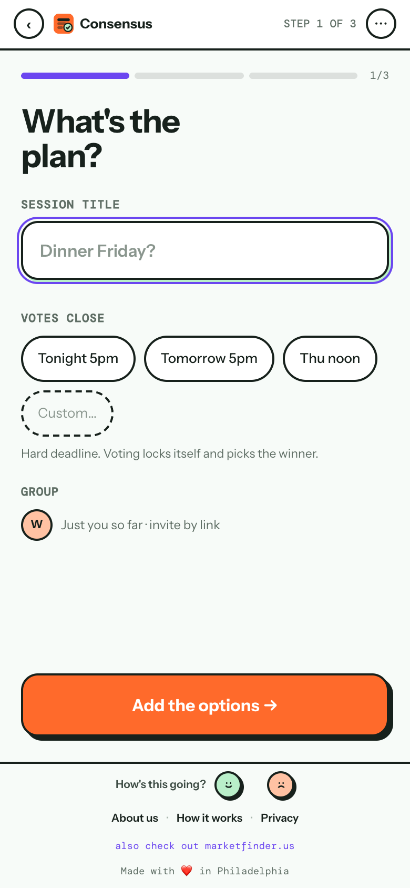

**Route:** `/groups/new` · **What I did:** tapped `Start something` on the signed-in home.

**The obvious next step here is** typing into `SESSION TITLE` — the field is focused, ring
and all — then picking a deadline chip and pressing `Add the options →`.

**Confusion (kind 1), the worst in the walk:** the `Custom…` chip. I tapped it as a naive
user would; the DOM did not change in any way. It is `disabled` with
`title="Coming soon"`, and a `title` tooltip cannot fire on a touch screen. The caption
underneath talks about deadlines locking, not about the chip. See summary item 1. Note
also that `Tonight 5pm` / `Tomorrow 5pm` / `Thu noon` are the only deadlines this app can
express — a real product limit that this chip's silence disguises as a missing feature.

`STEP 1 OF 3` in the header and `1/3` on the progress bar answer "how much more of this is
there" twice, and there is exactly one back control (`‹`), not the two the design comp
drew.

### 25 — filled in

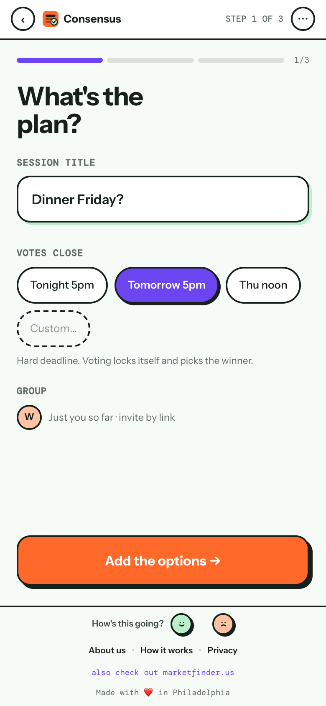

**Route:** `/groups/new` · **What I did:** typed a title and tapped `Tomorrow 5pm`.

**The obvious next step here is** `Add the options →`. The chosen chip inverts to solid
ink, so the selection is visible rather than implied.

### 26 — step 2, empty

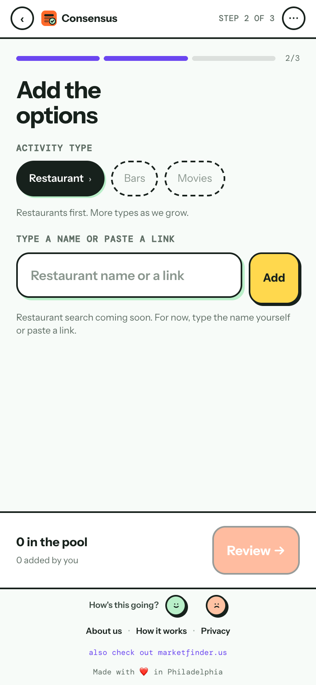

**Route:** `/groups/58/options` · **What I did:** pressed `Add the options →`.

**The obvious next step here is** typing into `Restaurant name or a link` and pressing the
yellow `Add`.

The bottom bar reads `0 in the pool` with `Review →` visibly faded — the gate is stated
and its reason is countable. *"Restaurant search coming soon. For now, type the name
yourself or paste a link."* pre-empts the obvious question. `Bars` and `Movies` are dashed
and grey with `Restaurants first. More types as we grow.` underneath — the exact
treatment §24's `Custom…` chip is missing.

### 27 — a name typed

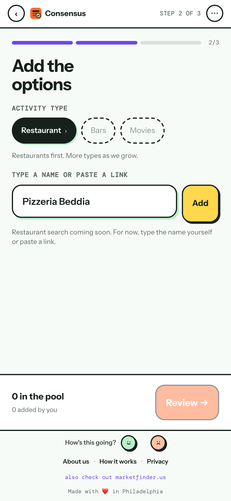

**Route:** `/groups/58/options` · **What I did:** typed `Pizzeria Beddia`.

**The obvious next step here is** the yellow `Add` next to the field.

### 28 — the first option is in

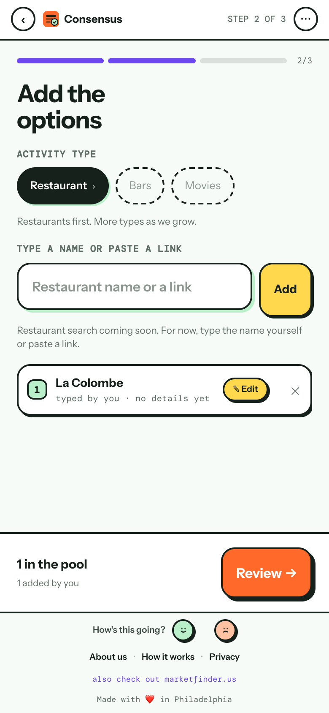

**Route:** `/groups/58/options` · **What I did:** pressed `Add`.

**The obvious next step here is** adding another, or `Review →`, which has now gone
tangerine and live.

The row explains its own provenance in the app's monospace voice —
`typed by you · no details yet` — so the difference between a typed option and a fetched
one is legible without opening anything.

### 29 — a URL pasted

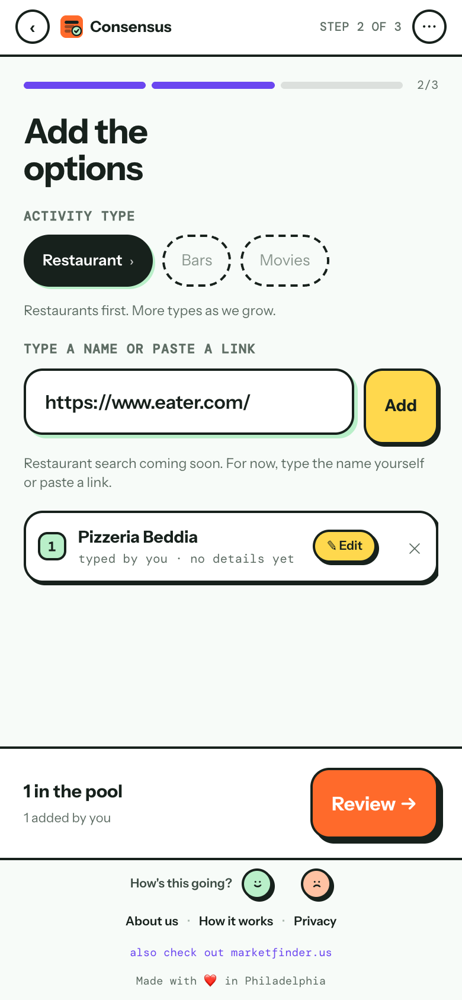

**Route:** `/groups/58/options` · **What I did:** pasted `https://www.eater.com/`.

**The obvious next step here is** `Add`. Nothing about the field changes for a URL, which
is correct — the label already said "or paste a link".

### 30 — fetching

**Route:** `/groups/57/options` · **What I did:** pressed `Add` on an uncached URL and
captured 120 ms later.

**The obvious next step here is** waiting — and the row says so: `fetching details…` under
a placeholder name. The option is already in the pool and already numbered, so nothing is
in limbo.

*This frame is from a second draft session,* because the eater.com preview was already
cached by the time I walked group 58 and resolved too fast to photograph. The pending
state is real and I confirmed it twice.

### 31 — the preview resolved

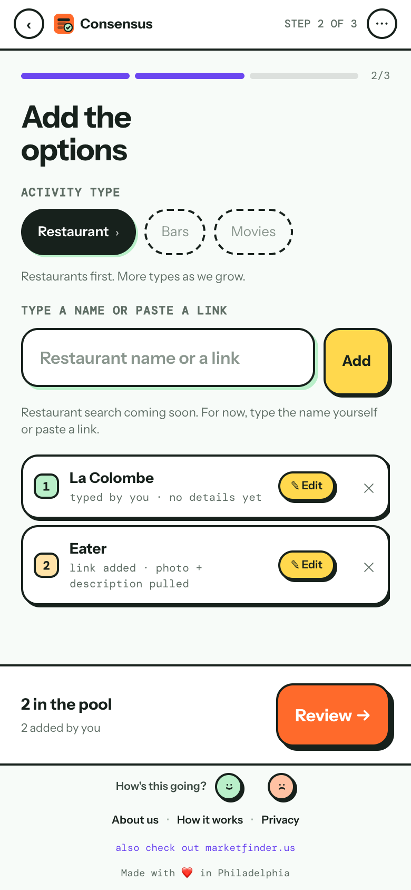

**Route:** `/groups/58/options` · **What I did:** waited.

**The obvious next step here is** `Review →`, or `✎ Edit` on either row.

The row now reads `Eater` / `link added · photo + description pulled`. Small gap: the row
*claims* a photo without showing one — the thumbnail only appears at step 3 (§35). The
claim is true, just unverifiable from here.

### 31b — when the fetch fails

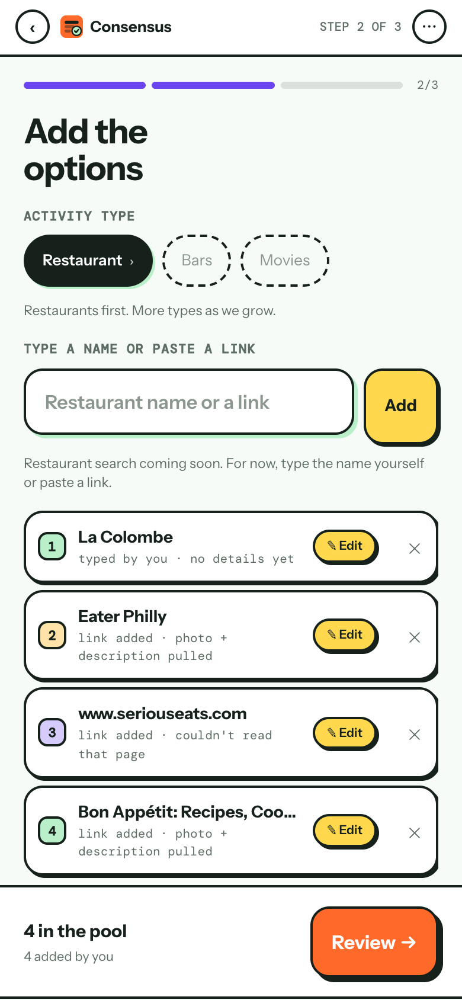

**Route:** `/groups/57/options` · **What I did:** pasted `https://www.seriouseats.com/`,
which refuses the fetcher.

**The obvious next step here is** `✎ Edit` to type a name by hand — or leaving it, since
the option is in the pool regardless.

Row 3 reads `www.seriouseats.com` / `link added · couldn't read that page`. This is the
right failure: the option is **not** lost, the failure is named in plain words, and it
does not block the flow. Row 4 shows a fetch that succeeded on the same screen, so the two
states are distinguishable at a glance.

### 32 — editing an option

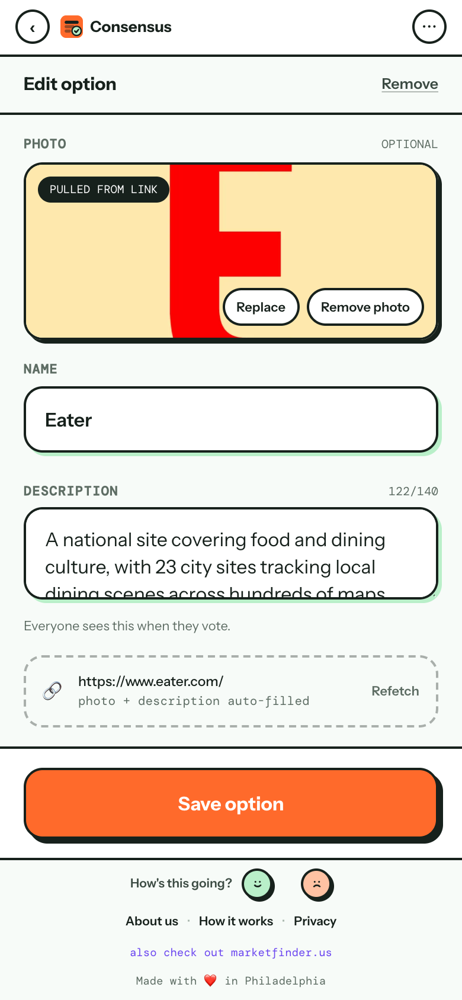

**Route:** `/groups/58/options/197` · **What I did:** tapped `✎ Edit` on the second row.

**The obvious next step here is** `Save option` — the one tangerine — after changing
whatever needs changing.

Careful work here: the photo carries a `PULLED FROM LINK` badge so its origin is
explicit; the destructive control is `Remove` (top right, with a `data-confirm` naming the
option) while the non-destructive one is `Remove photo` — two different words for two
different blast radii; the description counter reads `122/140` with no `maxlength` on the
textarea; and the link row offers `Refetch`. The `‹` is the only way back, per ruling 1.

The description textarea clips its third line mid-word rather than growing. It scrolls,
but the clip reads at a glance like a rendering fault.

### 33 — renamed

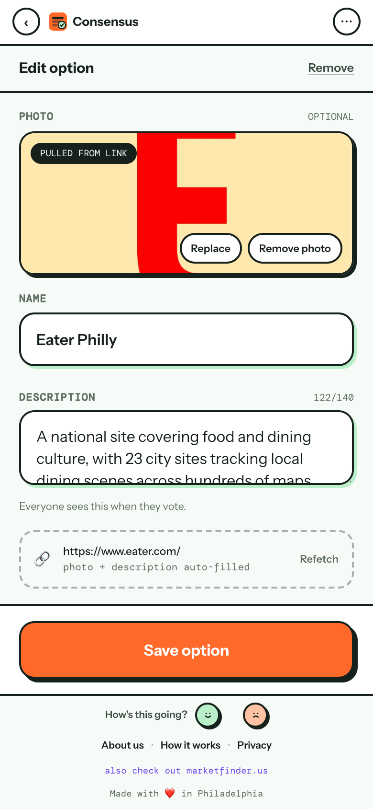

**Route:** `/groups/58/options/197` · **What I did:** changed the name to `Eater Philly`.

**The obvious next step here is** `Save option`.

### 34 — back on the list

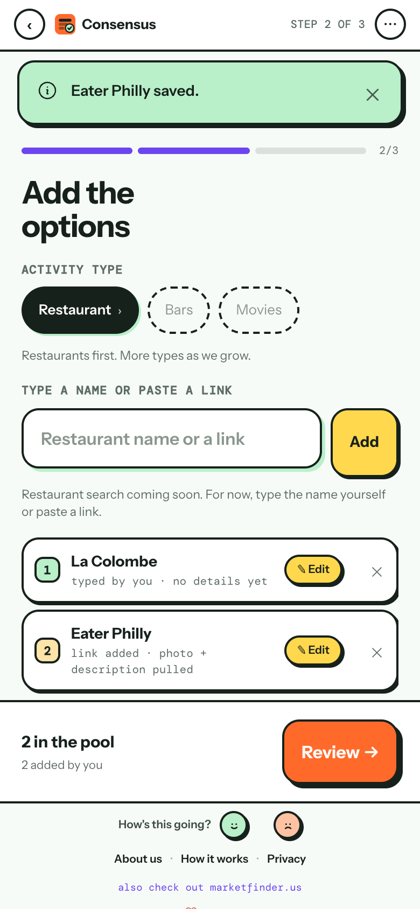
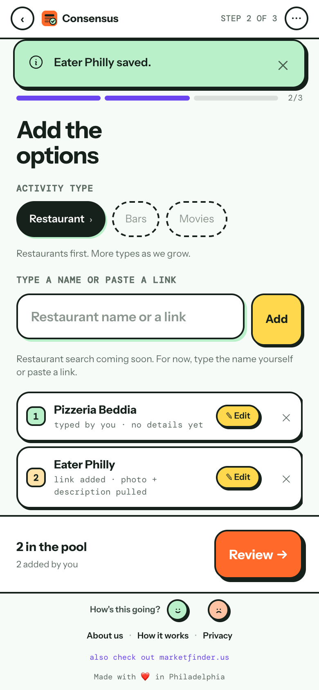

**Route:** `/groups/58/options` · **What I did:** pressed `Save option`.

**The obvious next step here is** `Review →`.

A green flash names what was saved — *"Eater Philly saved."* — not a generic "Saved", so
the confirmation matches the thing acted on. The row below shows the new name.

### 35 — step 3, the pool

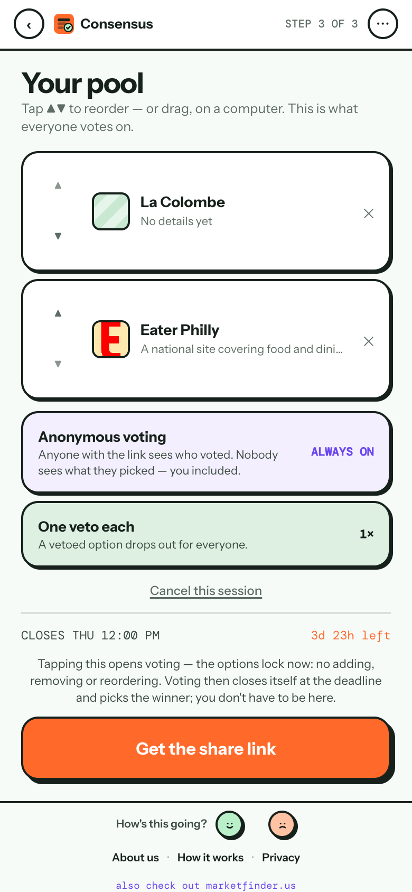
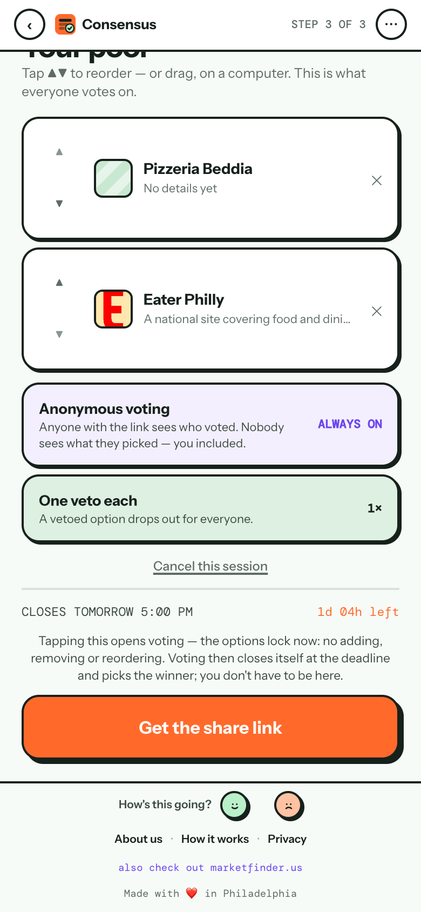

**Route:** `/groups/58/review` · **What I did:** pressed `Review →`.

**The obvious next step here is** the tangerine `Get the share link`.

The strongest screen in the app for the "unpredictable outcome" failure mode. Directly
above the button: *"Tapping this opens voting — the options lock now: no adding, removing
or reordering. Voting then closes itself at the deadline and picks the winner; you don't
have to be here."* That is all three of this product's irreversible behaviours stated
**before** the press. The anonymity card says `ALWAYS ON` rather than offering a toggle
that isn't real; the veto card says `1×`; `CLOSES THU 12:00 PM` sits next to a live
`3d 23h left`. Disabled reorder arrows are greyed per-row (the first row cannot go up),
and `Cancel this session` is present but visually demoted.

### 36 — the share screen

**Route:** `/groups/58/share` · **What I did:** pressed `Get the share link`.

**The obvious next step here is** `Copy link`, or the share-sheet card above it.

`Session is live` states the transition. The preview card shows exactly what recipients
will see, including the literal URL. `QR` is correctly drawn dashed with `SOON`.
`See live results →` is the way onward.

**Confusion (kind 5):** the four coloured tiles above `Open your phone's share sheet →`.
They are decoration inside that one button — I checked the markup — so any tap does the
right thing, but they are drawn as four fully-realised sticker buttons next to a `SOON`
tile that is honestly dashed. See summary item 2.

---

## Flow 6 — a guest votes in the sticker grid

Cold browser, no cookies, arriving at the share link.

### 37 — the entry screen

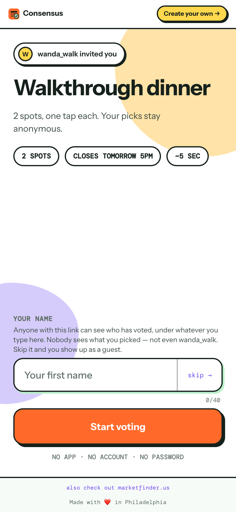

**Route:** `/join/tp9R3j0` · **What I did:** opened the share link with an empty cookie
jar.

**The obvious next step here is** typing a first name and pressing `Start voting` — or
`skip →`, which is inside the field itself.

Product invariant 1 holds: no signup, no password, no email, no app. `NO APP · NO ACCOUNT
· NO PASSWORD` is printed under the button. The privacy consequence of typing a name is
stated where the name is typed, not buried: *"Anyone with this link can see who has voted,
under whatever you type here. Nobody sees what you picked — not even wanda_walk."* The
header carries the `Create your own →` pill and no `⋯` and no `‹`, per ruling 2. At 390
there is a large empty band in the middle of this screen; at 375×553 it closes up (§73).

### 38 — the ballot, fresh

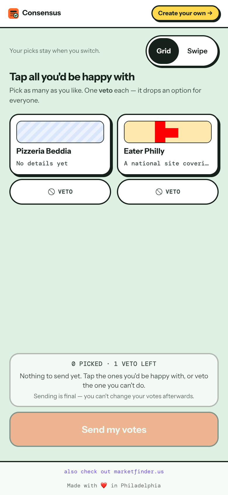

**Route:** `/join/tp9R3j0/vote` · **What I did:** entered `Greta` and pressed
`Start voting`.

**The obvious next step here is** tapping a card. `Send my votes` is visibly faded and the
panel above it says why: *"Nothing to send yet. Tap the ones you'd be happy with, or veto
the one you can't do."*

`Sending is final — you can't change your votes afterwards.` appears **before** the first
tap, not after submitting. The `Grid | Swipe` toggle is labelled with
`Your picks stay when you switch.` — mode, and the cost of changing mode, both signalled
(kind 7).

### 39 — one picked

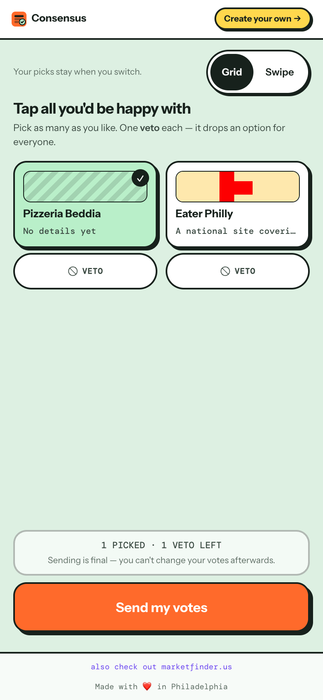

**Route:** `/join/tp9R3j0/vote?…&picked=196` · **What I did:** tapped the first card.

**The obvious next step here is** tapping more, or `Send my votes`, which is now live.

Three things changed at once: a ✓ badge on the card, the card fill going mint, and the
counter going `1 PICKED`. The selection is held client-side until submit, and it is
impossible to miss that it registered (kind 2, handled).

### 40 — picked and vetoed

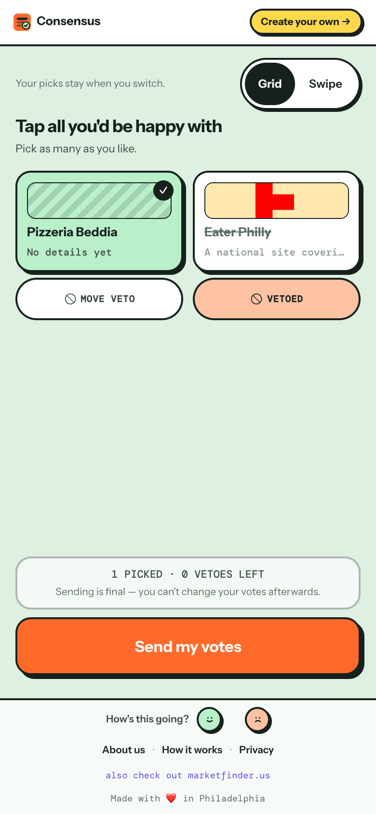

**Route:** `/join/tp9R3j0/vote?…&veto=197&picked=196` · **What I did:** vetoed the second
option.

**The obvious next step here is** `Send my votes`.

The vetoed card gets a struck-through title and its button becomes a filled `VETOED`; the
*other* card's veto button becomes `MOVE VETO`, which is how the app says "you have one
and it is spent, but not stuck". The counter reads `1 PICKED · 0 VETOES LEFT`, and the
helper line drops its now-irrelevant sentence about vetoing.

This screenshot also shows the current full `/join` footer. I verified the guard behind it
end to end: every link here — the `Create your own →` pill, both feedback faces, all three
standing links, and the outbound `marketfinder.us` link — carries
`data-confirm: "Leave without sending? Your picks aren't saved yet, and this link is the
only way back."` once anything is picked; each `?return_to=` carries the full pick state;
and I followed `About us` through and came back to find `1 PICKED · 1 VETO LEFT` intact.

### 41 — the same ballot as a swipe deck

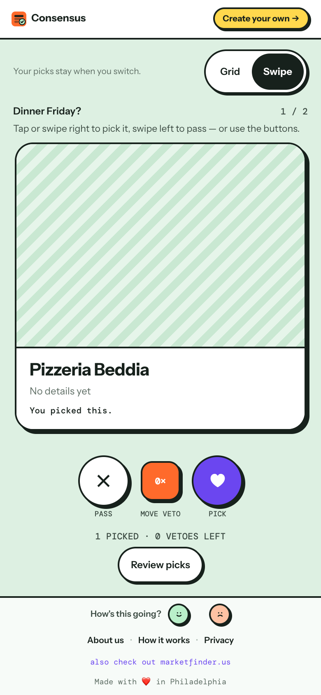

**Route:** `/join/tp9R3j0/vote?view=deck&…` · **What I did:** tapped `Swipe`.

**The obvious next step here is** `PICK` or `PASS` on the card in front of you — or
`Review picks`.

`1 / 2` answers "how much more of this is there" (kind 6). The card already carries
`You picked this.`, so the state survived the mode switch exactly as the label promised.
Instructions are given for both input methods: *"Tap or swipe right to pick it, swipe left
to pass — or use the buttons."*

Small note: the tangerine on this screen is on `MOVE VETO`, not on the forward action. The
design rule reserves tangerine for the one forward action per screen; here it marks the
destructive one and `Review picks` is a plain outline pill.

### 42 — back in the grid, ready to send

**Route:** `/join/tp9R3j0/vote?view=grid&…` · **What I did:** tapped `Grid` again.

**The obvious next step here is** `Send my votes`.

Round-tripped through both views with no loss. I also reloaded the page mid-ballot: a
`beforeunload` prompt appears, and accepting it and reloading restores the picks from the
URL.

### 43 — sent

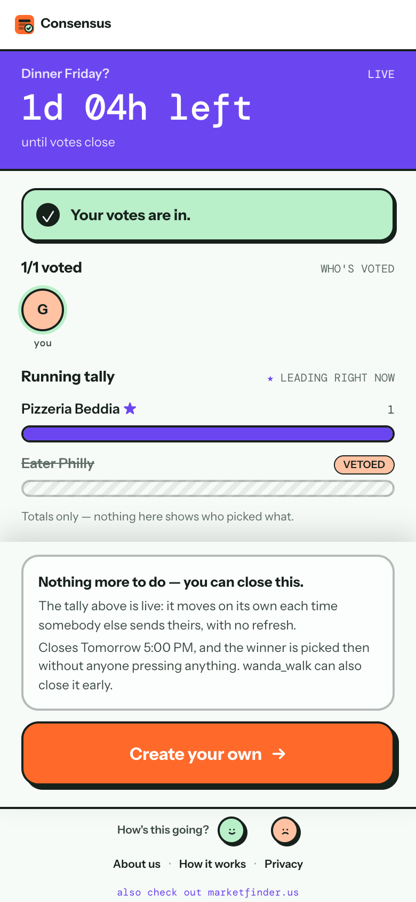
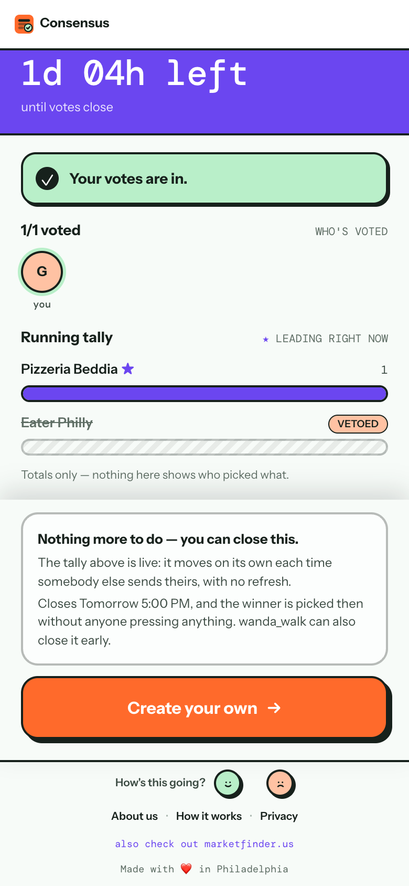

**Route:** `/join/tp9R3j0/results` · **What I did:** pressed `Send my votes`.

**The obvious next step here is** nothing — and the screen says exactly that:
*"Nothing more to do — you can close this."* Which is the correct answer, and rare.

It then explains that the tally moves on its own, names the closing time, and says the
organizer can close early. The vetoed option is struck through with a `VETOED` pill and a
hatched bar. *"Totals only — nothing here shows who picked what."* restates the anonymity
promise at the moment it matters. The forward action is `Create your own →`.

I also confirmed that going back to `/join/:slug/vote` after voting redirects here rather
than showing a re-votable ballot.

---

## Flow 7 — results, live and completed

### 44 — the organizer's live results

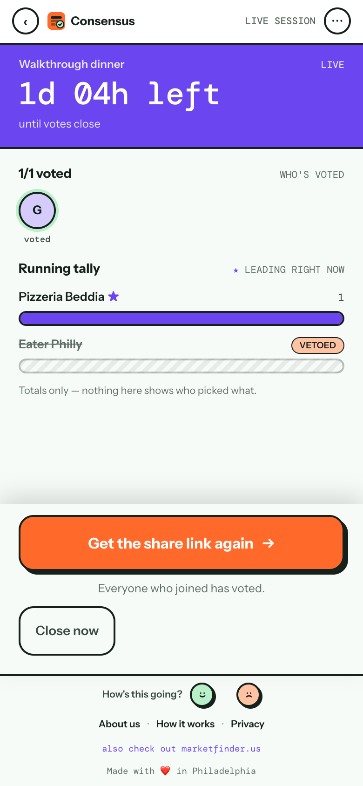

**Route:** `/groups/58/results` · **What I did:** switched to the organizer's session.

**The obvious next step here is** `Get the share link again →` (tangerine) to chase more
voters, with `Close now` as the demoted secondary.

The tally I had just cast appeared here over PubSub. `Everyone who joined has voted.` sits
between the two buttons and is what makes `Close now` a reasonable thing to consider.
`Close now` carries `data-confirm: "Close voting now? This can't be undone."`

### 45 — home, with a live session

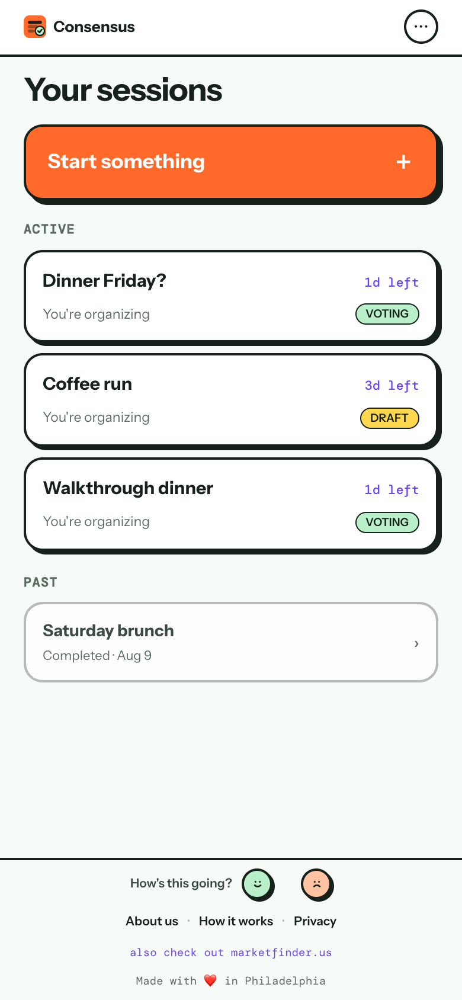

**Route:** `/` · **What I did:** tapped `‹`.

**The obvious next step here is** tapping the session card, or `Start something ＋`.

Cards carry status (`VOTING`), remaining time (`1d left`) and role (`You're organizing`).
Tapping routes by state — draft to the options step, voting and completed to results — so
the card always lands where there is something to do.

### 46 — the pool, frozen

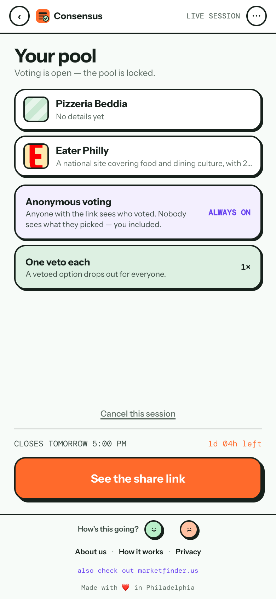

**Route:** `/groups/58/review` · **What I did:** navigated back to step 3 after
publishing.

**The obvious next step here is** `See the share link`.

The best demonstration of invariant 16 I found. The subtitle changed from *"Tap ▲▼ to
reorder"* to **"Voting is open — the pool is locked."**, and every editing affordance is
gone rather than disabled: no drag handle, no arrows, no `×`. The header context slot
reads `LIVE SESSION` and the button relabels from `Get the share link` to `See the share
link`. Nothing lies about what is still possible.

### 47 — a second session's share screen

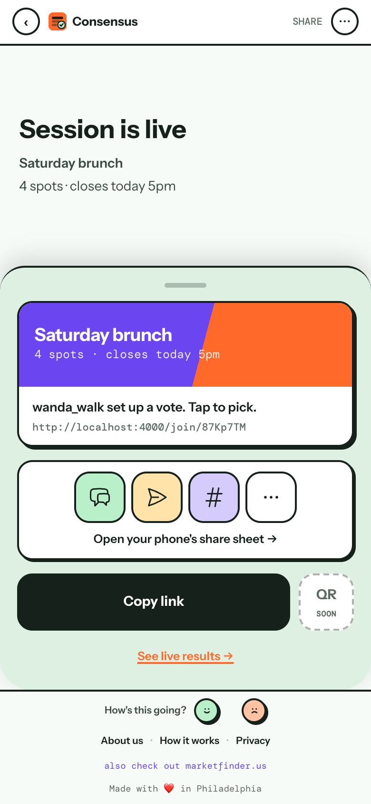

**Route:** `/groups/56/share` · **What I did:** built and published a second session,
*"Saturday brunch"*, with four options, to exercise the swipe deck properly.

**The obvious next step here is** `Copy link`.

*Frames 47–52 were captured before commit `eb9e1d5`, so their `/join` footer shows the
older credits-only treatment.*

### 48 — a guest who skips the name

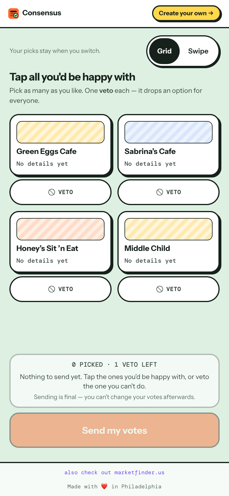

**Route:** `/join/87Kp7TM/vote` · **What I did:** opened the second link cold and pressed
`skip →`.

**The obvious next step here is** tapping cards.

Skipping goes straight to the ballot with no interstitial and no nagging. Four options
render as a two-column grid without crowding.

### 49 — the deck, card 1


**Route:** `/join/87Kp7TM/vote?view=deck&card=0` · **What I did:** tapped `Swipe`.

**The obvious next step here is** `PICK`, `PASS`, or `VETO`, each labelled under its
control, with `1 / 4` above.

### 50 — card 2, and an undo appears


**Route:** `…&card=1&picked=190` · **What I did:** pressed `PICK`.

**The obvious next step here is** deciding on card 2.

`Undo last card` appears only once there is something to undo — the counter reads
`1 PICKED · 1 VETO LEFT`. A swipe deck's classic failure is a mis-swipe with no way back;
that is covered here (kind 4).

### 51 — card 4

**Route:** `…&card=3&…` · **What I did:** passed one and picked one.

**The obvious next step here is** deciding on the last card; `4 / 4` says it is the last.

### 52 — end of deck


**Route:** `…&card=4&…` · **What I did:** vetoed the last card.

**The obvious next step here is** `Send my votes`.

Exactly what ruling 7 specified. Every card is listed with its outcome (`PICKED`,
`PASSED`, `VETOED`) and its own `Change` button, `Undo last card` is still there,
*"Change any of them before you send — nothing has been sent yet."* is stated, and
`Sending is final` is repeated immediately above the button. The deck ends in a decision,
not a cliff.

### 53 — the organizer's completed results


**Route:** `/groups/56/results` · **What I did:** pressed `Close now` and confirmed.

**The obvious next step here is** `Copy summary for the group chat` — and below it,
`Start another session →`.

The session ends in an action, not a summary (product invariant 5). The tie is *explained*
rather than merely displayed: *"2 options finished level on 1 approval. Green Eggs Cafe
takes it because it was first in the pool — no vote separated them."* — the tie-break rule
disclosed at the moment it decided something. `ALSO TIED` names the runner-up. The bottom
panel says the result stays at this address and everyone who voted can still open the link.

*This is the screen my first, full-page screenshot pass made look broken. It is not; the
capture was.*

### 54 — the participant's completed results


**Route:** `/join/87Kp7TM/results` · **What I did:** reloaded as the guest who voted.

**The obvious next step here is** `Copy summary for the group chat`, then
`Create your own →`.

*"This is the final result — your votes are counted in it. Nothing here changes from now
on."* closes the loop for someone who might otherwise keep checking. The anonymous guest
shows as `?` labelled `you`.

### 55 — home, with a finished session


**Route:** `/` · **What I did:** went home.

**The obvious next step here is** `Start something ＋`.

Finished sessions move to a `PAST` group labelled `Completed · Aug 9`, so the `ACTIVE`
list stays a to-do list.

---

## Flow 8 — feedback from the middle of a flow

### 56 — the form, carrying where I came from


**Route:** `/feedback?mood=sad&return_to=%2Fgroups%2F57%2Freview` · **What I did:** tapped
the sad face in the footer while on step 3 of the wizard.

**The obvious next step here is** typing into `WHAT HAPPENED` and pressing `Send feedback`.

The checkbox now reads `Include the screen I was on (Reviewing the pool)` with the literal
path under it — a human name *and* the raw value. Signed in, the `NAME` field disappears
and the paragraph explains why: *"You're signed in, so this arrives under your account,
wanda_walk, either way."* The `‹` goes back to step 3.

### 57 — filled in


**Route:** same · **What I did:** wrote a real complaint — the one from summary item 1.

**The obvious next step here is** `Send feedback`.

### 58 — the thank-you


**Route:** `/feedback?sent=1&return_to=%2Fgroups%2F57%2Freview` · **What I did:** pressed
`Send feedback`.

**The obvious next step here is** `Back to what you were doing →`, which returns to
`/groups/57/review` — the exact screen I left.

A full page, not a flash, per the plan's premise. It says the note is saved, says nobody
was emailed, and repeats what was attached. Only blemish: the path renders as
`/groups/57/r` / `eview`, broken across a line mid-word (summary item 5).

---

## Flow 9 — admin

### 59 — signed in as an administrator


**Route:** `/` · **What I did:** logged in as `aheld` with a password.

**The obvious next step here is** `Start something ＋`, or `⋯` for the admin area.

This dev account has a long session list from other agents, which is why the page is
~3,900px. Nothing about being an administrator is announced on the home screen — correct,
since `/` is the product, not the console.

### 60 — the admin's account menu


**Route:** `/` · **What I did:** tapped `⋯`.

**The obvious next step here is** `Admin`, which only exists for administrators
(`Admin`, `Settings`, `Log out`).

### 61 — users


**Route:** `/admin/users` · **What I did:** tapped `Admin`.

**The obvious next step here is** `Change it now` in the yellow warning, or
`Go to Admin → Feedback (24 unread)`.

The bootstrap-password warning is loud and states the consequence (*"Anyone who can reach
this site can sign in as an administrator"*). The lede warns that deleting an account
frees its email address and why that matters on a deployment with no mail provider. Each
card shows role, confirmation state and join date. The two admin screens cross-link each
other, and the sibling's unread count travels with the link.

### 62 — feedback


**Route:** `/admin/feedback` · **What I did:** followed the cross-link.

**The obvious next step here is** `Mark read` or `Add a note` on the first unread card —
mine, at the top.

`32 messages, 24 unread` answers the scope question (kind 6) before any scrolling. The
lede is unusually honest: it says voting screens carry no feedback pair so *"silence from
voters is not evidence that nothing is wrong"* — a caveat about the data's own bias,
inside the tool that displays it. Each entry shows mood, read state, whether an account
was linked, and the screen the sender was on as a link marked `(opens a new tab)`.

The page is ~9,800px with no pagination or filter. The count at the top means you know
what you are in for, so this is a scaling note rather than a confusion.

### 63 — marked read


**Route:** `/admin/feedback` · **What I did:** pressed `Mark read` on the top entry.

**The obvious next step here is** moving to the next unread entry — or `Mark unread`,
which is what the button became.

Three things moved together: the `UNREAD` pill vanished, the counter went `24 unread` →
`23 unread`, and the button relabelled. The action is reversible and says so by its label.

### 64 — unmarked again


**Route:** `/admin/feedback` · **What I did:** pressed `Mark unread`.

**The obvious next step here is** anything — the entry is exactly as it was.

Counter back to `24 unread`, `UNREAD` pill back. A clean round trip.

### 65 — writing a note


**Route:** `/admin/feedback` · **What I did:** pressed `Add a note` and typed.

**The obvious next step here is** `Save note`.

`ADMIN NOTE` with a `73/1000` counter and no `maxlength`, and the two things an
administrator would wonder about answered inline: *"Private to admins."* and *"Saving
emails nobody."*

### 66 — saved


**Route:** `/admin/feedback` · **What I did:** pressed `Save note`.

**The obvious next step here is** the next entry.

Flash: *"Note saved. Nobody was emailed."* — the confirmation repeats the reassurance
rather than assuming it was read the first time.

### 67 — still there after a reload


**Route:** `/admin/feedback` · **What I did:** reloaded the page from scratch.

**The obvious next step here is** the next entry.

The note is still in the textarea with its `73/1000` counter — it persisted. The `Hide
note` toggle is also still expanded, so the annotation is visible without hunting.

---

## Flow 10 — logging out

### 68 — back at the splash


**Route:** `/` · **What I did:** `⋯ → Log out`.

**The obvious next step here is** `Start something` or `Log in` — the signed-out splash,
with *"Logged out successfully."* on top.

Landing on `/` rather than on the log-in form is right: `/` is one route for two screens,
so a bookmark does not 404 after logging out.

### 69 — a private URL while signed out


**Route:** `/groups/57/review` → `/users/log-in` · **What I did:** opened a bookmarked
organizer URL after logging out.

**The obvious next step here is** logging in, by either method on the page.

*"You must log in to access this page."* names the cause rather than dumping someone on a
login form with no explanation.

---

## The short-viewport pass — 375×553 (iPhone SE)

I re-walked the screens whose layout depends on a sticky bottom bar. **Every primary
action is reachable, and on every screen where it sits below the fold, the fold cuts
through content mid-element so the page visibly continues.** No false bottoms.

| # | Screen | Primary action | Verdict |
|---|---|---|---|
| 70 | `/`  | `Start something` at y=579 | below the fold; card 3 is cut mid-card — clear scroll cue |
| 71 | `/groups/new`  | `Add the options →` at y=542 | its top sliver is on screen — unmissable |
| 72 | `/groups/:id/review`  | `Get the share link` at y=678 | below the fold; the veto card is cut mid-card |
| 73 | `/join/:slug`  | `Start voting` at y=495 | **fully on screen** — the 390 layout's empty band closes up, and `1 friend already voted` appears |
| 74 | `/feedback`  | `Send feedback` at y=473 | on screen, sticky bar pinned |
| 75 | `/groups/:id/results`  | `Get the share link again` at y=383 | on screen |
| 76 | completed results  | `Start another session` at y=473 | on screen |
| 77 | ballot, grid  | `Send my votes` at y=469 | on screen |
| 78 | ballot, deck  | `PASS`/`VETO`/`PICK` at y=441 | **all three on screen**; `Review picks` just below with a sliver visible |

The two screens where a guest can lose something — the ballot in both views — keep their
controls fully visible at the shortest viewport tested. That is the right priority.

---

## The dead-end hunt — error and edge paths

I went looking for the screens that usually rot. These are the results.

### 79 — a share link that does not exist


**Route:** `/join/zzzzzzz` → `/` · **What I did:** mistyped a slug.

**The obvious next step here is** `Start something`, or re-opening the real link — and the
flash says *"That link doesn't look right."*

No 404 page, no stack trace: a redirect to the splash with a plain-language explanation.

### 80 — registration validation


**Route:** `/users/register` · **What I did:** submitted `not-an-email` and a 5-character
password.

**The obvious next step here is** fixing the two named fields.

Errors are per-field and in the user's terms — *"must have the @ sign and no spaces"* —
not `has invalid format`.

### 80b — a username that is taken


**Route:** `/users/register` · **What I did:** submitted an existing username with an
otherwise valid form.

**The obvious next step here is** picking another username; `has already been taken` sits
under `USERNAME`, and everything I typed is still in the form.

### 81 — the wrong password


**Route:** `/users/log-in` · **What I did:** typed a wrong password.

**The obvious next step here is** trying again, or `Send magic link` above — which is the
actual recovery route and is already on the page.

*"Invalid email/username or password"* deliberately does not say which was wrong.

### 82 — the organizer cancels a session


**Route:** `/groups/57/review` → `/` · **What I did:** published a session, then pressed
`Cancel this session` and confirmed *"Cancel Coffee run? This cannot be undone."*

**The obvious next step here is** `Start something ＋`; the flash reads *"Coffee run was
cancelled."* and the session has moved to `PAST` as `Cancelled · Aug 9`.

### 83 — a guest opens a link to a cancelled session


**Route:** `/join/YmX6kkg` → `/join/YmX6kkg/results` · **What I did:** opened, from a cold
browser, a link the organizer had cancelled after sharing.

**The obvious next step here is** `Create your own →`.

This is the path I most expected to be broken and it is the one that impressed me most.
The guest gets a named state (`Session cancelled`), the reason, **who** did it, and what
can and cannot happen next: *"wanda_walk called it off, so no winner was picked. If that
was a mistake, they can start a new one — this session cannot be reopened."* Nobody is
left staring at a blank ballot or a 404 wondering whether they voted.

---

## What I could not test, and why

Listed so nobody reads a gap as a pass.

1. **A share link for an unpublished (`:draft`) session.** The router guards `:draft` by
   bouncing home with a flash, but I could not reach it: the slug is not rendered anywhere
   in the UI before publishing — not on the review screen, not in the page source — so
   there is no way for a draft link to exist in someone's chat. That is arguably the right
   answer, but the guard itself is untested here.
2. **A deadline actually expiring while someone is on the ballot.** The shortest selectable
   deadline is "Tonight 5pm", so I could not watch a live session close by itself, which
   is product invariant 3's central promise. I only exercised the organizer's manual
   `Close now`.
3. **More than one voter at a time.** Every session I ran ended `1/1 voted`. I never saw a
   tally move under a second voter's live update, so the real-time claim on the results
   screen (*"it moves on its own each time somebody else sends theirs"*) is unverified by
   me — I only saw one guest's vote appear in the organizer's already-open session.
4. **Real swipe gestures.** I drove the deck with its `PASS`/`VETO`/`PICK` buttons. The
   drag/swipe path and its hook were not exercised; the on-screen instructions offer both,
   so a broken swipe would still leave a working ballot, but I did not prove the swipe.
5. **`/admin/dashboard` (LiveDashboard).** Out of the requested flows, and it deliberately
   wears no chrome.
6. **`/users/settings`.** Reachable from the `⋯` menu but not in the requested flows, so
   not walked — including its sudo-mode gate and email-change flow.
7. **Sudo-mode expiry on the admin writes.** I logged in with a password immediately
   before using `/admin/users`, so I was inside the 20-minute window throughout and never
   saw `#sudo-notice` or a `:sudo_required` refusal. I also did not exercise
   promote/demote/delete, only read.
8. **The magic-link `{:refused, address}` state.** The copy exists
   (*"No link was sent. This page has already sent as many as it will…"*) but it is
   unreachable from the UI: the only control that could trigger it is removed when the
   budget is spent, so the state is reached only by a forged event. I documented §21 and
   §22, which is what a real user sees.
9. **Anything on the deployed site.** This walk is entirely against `localhost:4000`.
10. **Stability of the tree.** Other agents were editing this working tree throughout.
    Frames 47–52 predate commit `eb9e1d5`; everything else reflects the tree at the time
    of the walk. A re-walk after the current round lands could differ.
